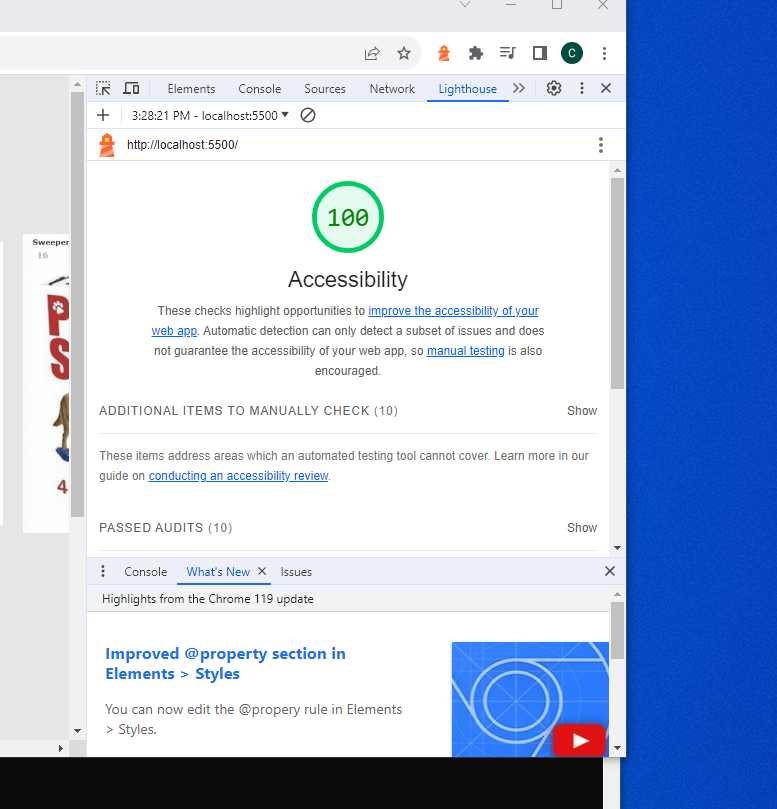

# LAB - 11

## Odd-Duck

This is the Odd-Duck Project. Today I added a chart to display the results. Updated app.js to filter previous image to ensure no consequtive images render.

### Author: Christopher Acosta

### Links and Resources

### Lighthouse Accessibility Report Score

* Lighthouse score for Lab 12!

  

### Reflections and Comments

#### Reading Journal entry

* The lab was a little difficult. I was having trouble coming up with logic to not render the same item consequtively. I tried out some ideas before I asked my brother to take a look. He helped me come up with the answer. In the renderItems function, I declared a new set to store the previously made images and using a while loop, detect if they were just used before. Adding a chart wasn't too difficult. I followed John's example closely and successfully rendered a new chart with the data in my textContent section. The page still looks wonky if you scale it up or down though. I'm not too sure how to fix that. All in all the lab went good.

#### Notes

* Using databases is a huge plus. Not having to code out the charts saves a ton of time
