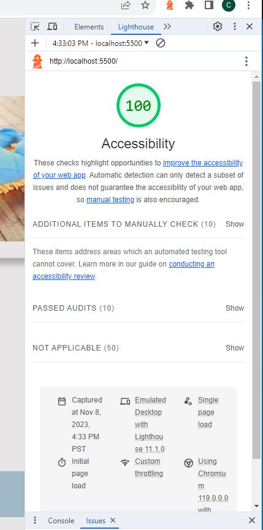

# LAB - 11

## Odd-Duck

This is the Odd-Duck Project. Today I added functionality to set local storage and get local storage and fixed the layout of the page a bit.

### Author: Christopher Acosta

### Links and Resources

### Lighthouse Accessibility Report Score

* Lighthouse score for Lab 13!

  

### Reflections and Comments

#### Reading Journal entry

* The lab was difficult at first. I understood the concept of localStorage set and get, but I was confused where to use it. After some trial and error I got it. I also fixed some page layout issues. The lab took awhile to start but quick to finish once I understood it better.

#### Notes
