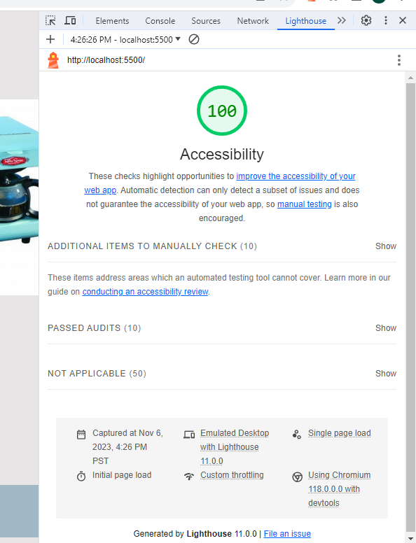

# LAB - 11

## Odd-Duck

This is the Odd-Duck Project. Added html, js, css

### Author: Christopher Acosta

### Links and Resources

### Lighthouse Accessibility Report Score

* Lighthouse score for Lab 9!

  

### Reflections and Comments

#### Reading Journal entry

* The lab was not so hard. John's lecture prepped us pretty good on how to go about doing it. Working with grids is a lot easier than working with flex box, so I didn't have to spend so much time messing with it like before. I'm definitely getting more comfortable with my js.

#### Notes

* Grid is better than flexbox
